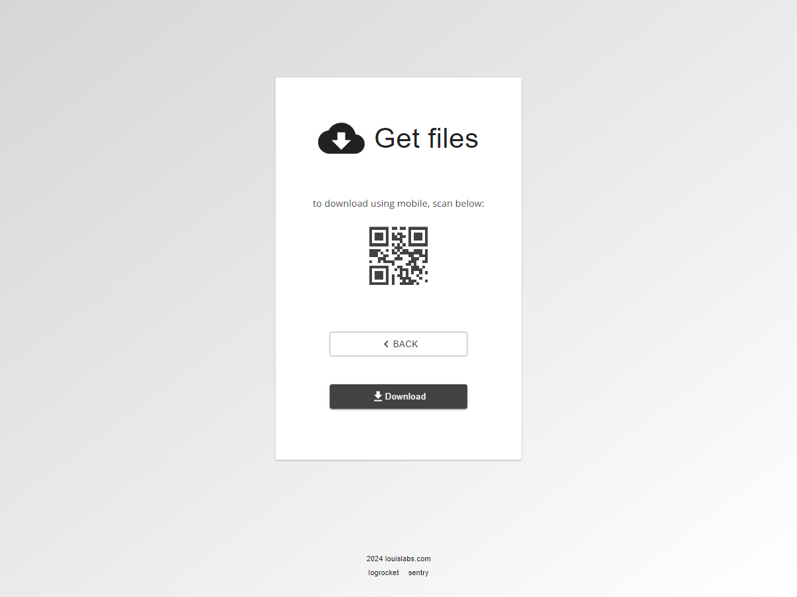
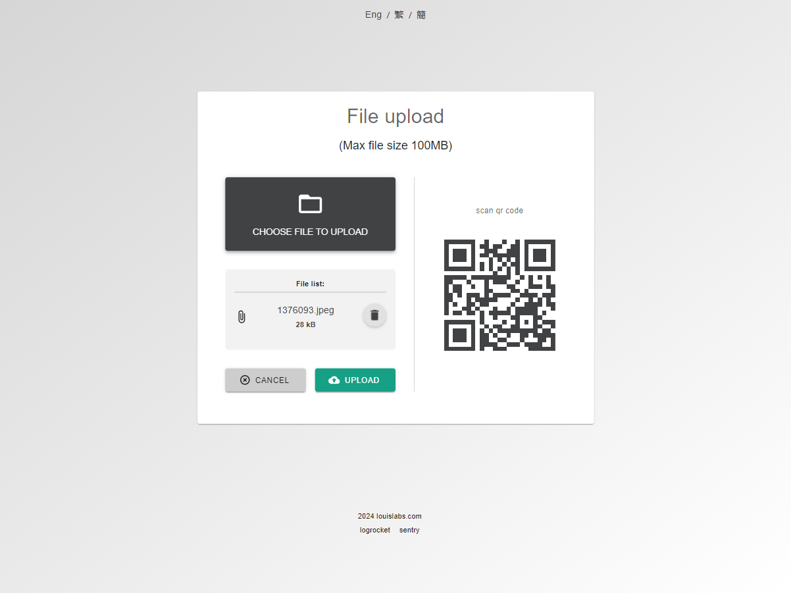
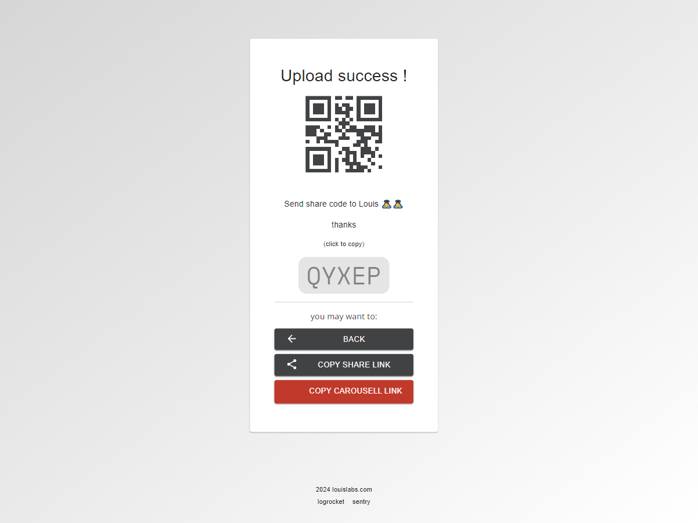
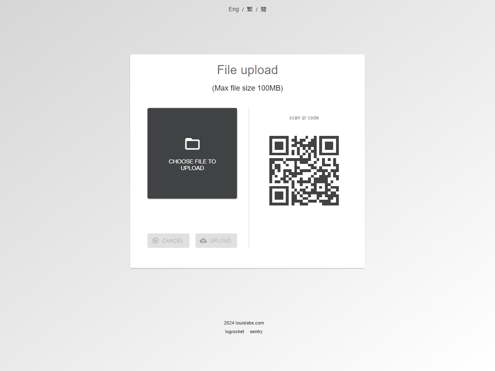

# nextjs-upload-file-tryout

# README

documentation url:
[https://louiscklaw.github.io/nextjs-upload-file-tryout/](https://louiscklaw.github.io/nextjs-upload-file-tryout/)

### screenshots

### share file process





#### multi-lingual support




### error reporting

- sentry
- logrocket

### TODO:

- [x] init commit

### dev (docker image)

```bash
# build and push docker image
$ git pull && ./scripts/dc_build.sh

# on target machine
$ ./scripts/dc_update.sh

```

### dev (application linux / windows)

```bash
$ cd src
$ yarn
$ yarn dev
```

### build (application linux/windows)

```bash
$ cd src
$ yarn
$ yarn build
```

### deploy

```bash
docker build -t upload_louislabs_com .
docker tag upload_louislabs_com 192.168.10.61:5000/upload_louislabs_com
docker push 192.168.10.61:5000/upload_louislabs_com

docker compose up -d

.\dc_up.bat
./dc_up.sh

```

# TODO

discord alert to louis when file arrive

### deploy docs page

for windows
open a batch console
in windows console

```batch
$ yarn build
```

open a wsl console

```batch
$ yarn gh_page_deploy
```
